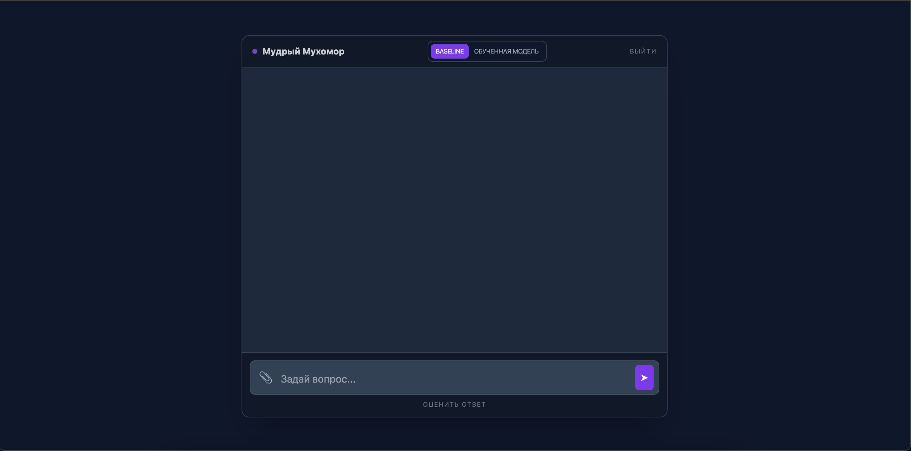

# 🍄 MycoAI (Грибной ИИ) Проект на основе нейронной сети для определения съедобности грибов по изображению.

**Миссия:** Создать удобное приложение для определения съедобности грибов

---

## 🚀 О проекте

Наше приложение позволяет:
- 📲 Загружать изображение гриба
- 🧠 Анализировать его с помощью нейронной сети
- 💻 Определять, является ли гриб съедобным или ядовитым
- ✅ Получать быстрый результат классификации

Технологии, которые мы используем:
- **Frontend:** Telegram bot
- **Backend:** Python, Aiogram

---

## 🧑‍🤝‍🧑 Наша команда

### Роли🥇 
- **Воронин Иван**
- **Покидько Никита**
- **Битюков Кирилл**
- **Рогожников Кирилл**

---

## 🌟 Особенности приложения
- **Удобство:** Загрузка изображения гриба через веб-интерфейс или Telegram-бота
- **ИИ-анализ:** Автоматическое определение съедобности гриба по фото
- **Быстрота** Получение результата за считанные секунды
- **Простота использования:** Не требует специальных знаний — достаточно загрузить изображение

---

## ⚙️ Технологический стек

- **Python** Основа проекта и реализация всей логики
- **Aiogram:** Создание Telegram-бота и обработка сообщений
- **PyTorch / TensorFlow** Обучение и запуск нейронной сети для классификации изображений
- **OpenCV / Pillow:** Обработка и подготовка изображений
- **NumPy / Pandas** работа с данными и датасетом/

## Превью
| Страница  | Пример интерфейса             |
|-----------|-------------------------------|
| Страница регистрации   |       |
| Чат |    |

## Project brief

https://docs.google.com/document/d/1fg__M3OouRDHOpImmsRDZpof_K2TxFoq/edit?usp=sharing&ouid=106833048523028845607&rtpof=true&sd=true

## Описание датасета

В проекте используется датасет изображений грибов для задачи бинарной классификации:
- edible — съедобные грибы
- poisonous — ядовитые грибы

### Предобработка данных:
- удалены повреждённые изображения
- удалены дубликаты
- изображения приведены к размеру 224x224
- данные разбиты на train / val / test
- сформирован файл dataset.csv с путями к изображениям и метками классов